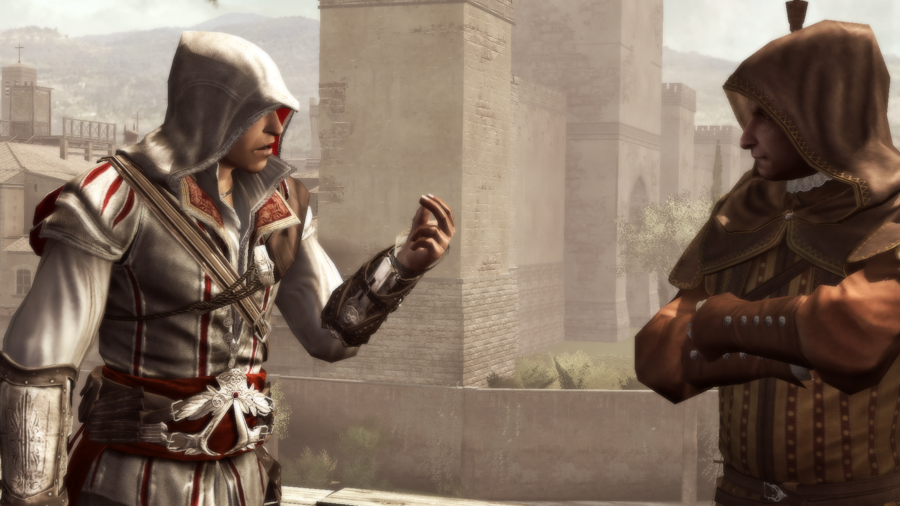
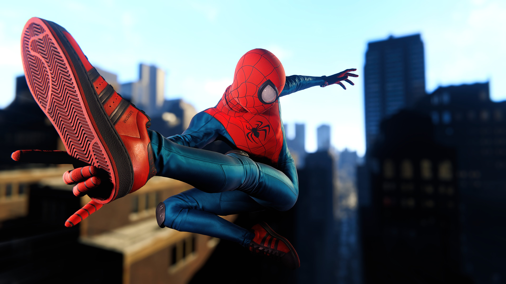
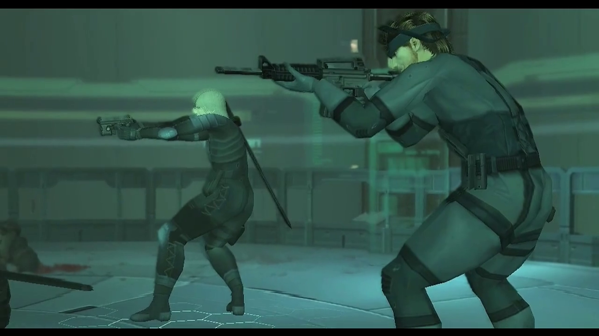
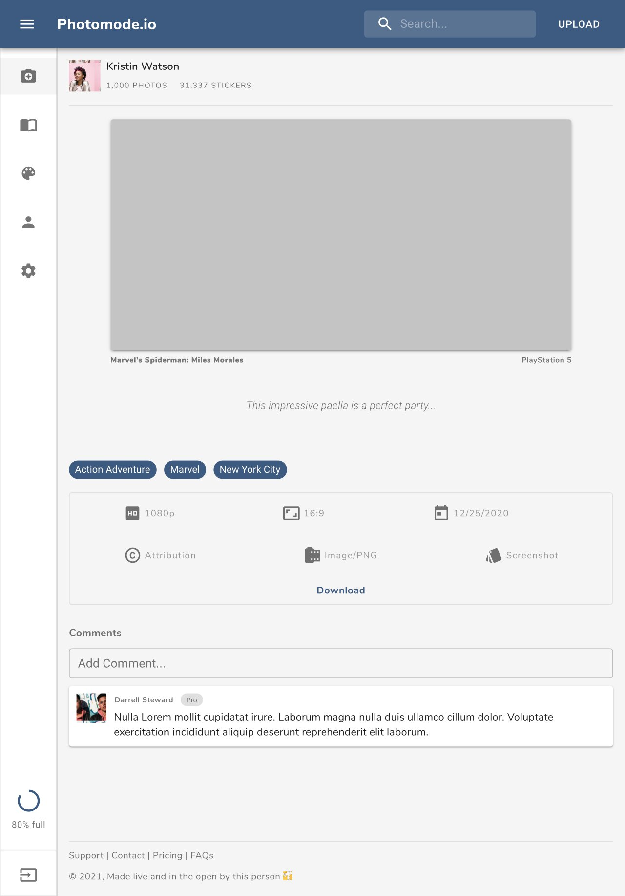
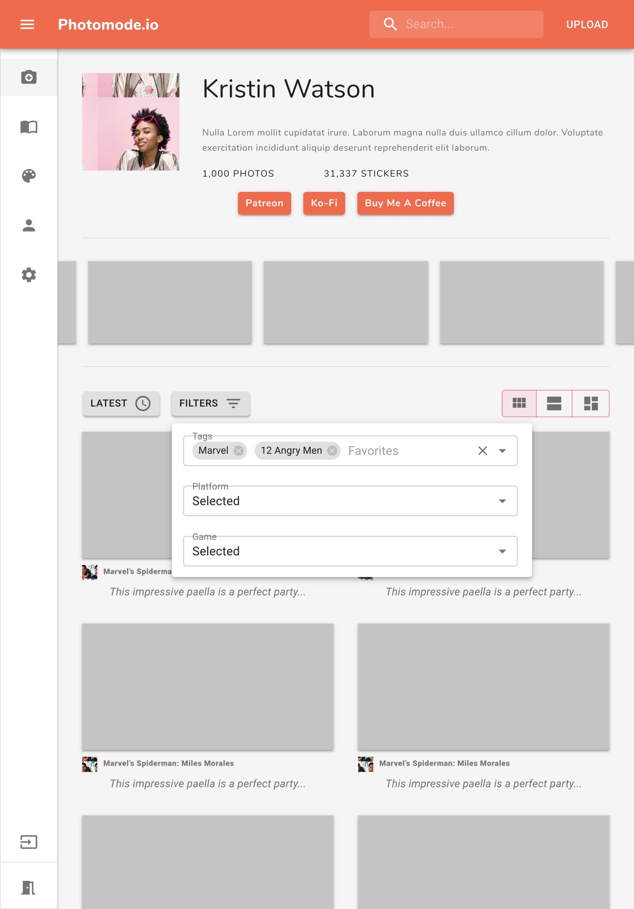

import { Typography, Link } from "@material-ui/core"

I...hate New Year's resolutions.

I don't know why, but the idea of waiting for a specific date to come for me to start doing something that improves my life has never sat well with me. So in classic "Isaiah" fashion, I decided to say "fuck that" and started building the idea I had for a SaaS product last month in the middle of December.

As I mentioned in my previous post, I love the idea of building. And, even more, I love the idea of building something I can support myself with. The IndieHackers bug has bitten me, and—to be honest—it feels good to have finally found a community of people I can relate to. So I've committed myself to learn, build, and launch a SaaS business. I'm doing this in the hope that it will push me to grow professionally, expand myself socially, and sustain my relatively modest lifestyle financially.

# So what IS the business anyway?

One piece of advice you'll sometimes see shared within the IH community is to pick an audience that you know and solve a pain point for them. And if there's one industry I follow and know pretty well, it's the gaming industry. From following the most prominent game releases, understanding the changes gaming platforms are making to push the industry forward, and even keeping up with the indie dev scene where a lot of creative innovation happens, I keep close tabs on the gaming industry. Knowing all this and more, I want to create a hub for sharing and discovering video game photos, gifs, and clips.

Now, I know what you might be thinking. "Really? Video game photos"? Yes! Video game photos. Taking photos of video games is not what it used to be for a few reasons.

Video games have gotten so...damn...pretty.

Take a second and think back to watching one of the earlier Pixar movies. Something like Finding Nemo. You remember it looking pretty good, right? I know I do. The thing is, if you've seen any recent Pixar movies, like Toy Story 4 or Onward, and you go back and watch Finding Nemo now, you'll be immediately reminded of just how far Pixar's rendering technology has come. And this isn't to say that Finding Nemo looks bad either. It's more to emphasize how much technology has advanced in the last decade and a half. Sometimes it's completely night & day.

<Typography variant="caption" align="center" style={{ display: "block" }}>
  <Link href="https://www.igdb.com/games/assassin-s-creed-ii" target="__blank">
    Assassins Creed 2 (via IGDB)
  </Link>
</Typography>

<Typography variant="caption" align="center" style={{ display: "block" }}>
  <Link href="https://twitter.com/dotpone/status/1339981907707260930" target="__blank">
    Marvel's Spider-Man: Miles Morales (via DotPone on Twitter)
  </Link>
</Typography>

Games are no different. Games that used to be "mistaken for real-life" photos then may now look aged and dated in comparison to what's being released today.

<Typography variant="caption" align="center" style={{ display: "block" }}>
  <Link href="https://www.igdb.com/games/metal-gear-solid-2-sons-of-liberty" target="__blank">
    Metal Gear Solid 2: Sons of Liberty (via IGDB)
  </Link>
</Typography>

People LOVE sharing cool moments

If there's one thing that the digital age has given us, it's the ability to share moments with people on the internet. And boy, do we love to do it.

But unlike before, where you'd share a personal moment with your distant aunts and uncles, people now have vast networks of friends, peers, and interested followers. Sharing has changed. The rise of internet influencers has reshaped how we use social media. And this isn't necessarily a bad thing.

As much as we're constantly checking our phones and refreshing our feeds, we're also making connections with other people. Like I mentioned earlier in this post, I found the IndieHackers community through a podcast that was shared on Reddit, which ended up in a newsletter I subscribe to, that I actually found from a YouTuber I follow. (_phew_ did you follow all that?)

I think that making it easier to find and share cool moments in video games would be pretty cool. You often see people posting to Twitter, or maybe even Instagram, with something that happened to them. Or perhaps you stumble onto a subreddit that has a few dozen posts featuring cool snapshots. The thing is, there isn't really a singular place to go that's tailor-made for you to share video game photos. There are places to share videos, like Twitch and YouTube gaming. There are places to share audio-based content, like some of the fantastic podcasts you can find on Apple Podcasts or Spotify. But there is no "Instagram for video games." I want to change that if I can.

# Tempered Expectations

Because this is my first attempt at building a SaaS business, I want to make sure I go about things in a well thought out and sustainable way. This means being very thoughtful about what it is I build, how I build it, and how I price it.

One important thing I want to make sure I constantly follow is to "reach profitability sustainably." Most things I build tend to be for fun, and "for fun" projects don't really need to be profitable (or last long, for that matter), so this is somewhat of a new way of building for me. I need to make sure the product decisions I make don't cost too much to maintain and don't take too long to build.

# Initial Roadmap

To not get too ahead of myself, I've broken down some of the initial features I think would be most valuable to users and divided them up into various tiers. For MVP, the free Community Tier is the one I'm focusing on first, followed by the Community+ Tier and Hobbyist Tier.

During this entire process, I'll be listening closely to customers, interviewing users, and getting a better sense of what actually is the best value for everyone. I plan on being nimble and pivoting things when needed to make this work. That is one of the biggest strengths of being an IndieHacker, after all

### Community Tier (Free)

- Users can browse public photos on the site
- Users with verified emails get 50MB of storage space
- Users can upload images via the browser
- Users get basic profiles (displays essential info such as bio, avatar, albums, etc.)
- Unlimited image resizes (within storage limitations)
- All photos uploaded under Creative Commons Zero (CC0) license

### Community+ Tier (1-time \$5)

- Everything in Community Tier
- Upgrade storage to 500MB of storage space

### Hobbyist Tier ($3mo / $30yr)

- Everything in Community+ Tier
- Upgraded to 50GB of storage space
- Can draft photos for further editing before publishing
- Can upload images via Twitter
- Can claim "pretty" profile URL
- Premium profile design (custom primary color, featured photo, "support me" buttons, etc.)
- Option to add a custom watermark to photos
- Option to select Creative Commons license of choice (default to Attribution)

### Creator Tier ($10mo / $100yr)

- Everything in Hobbyist Tier
- Upgraded 200GB of storage space
- Access to Photomode Studio (in-app photo editing)
- Unlimited image "remixes" (non-destructive image variants)
- Priority Support

### Professional Tier ($30mo / $300yr)

- Everything in Creator Tier
- Upgraded 1TB of storage space
- Can upload images via API

# Where do I go from here?

Now that I have the idea roughly figured out, I'm currently in the middle of core architecture and design. I'll go more into details on the actual tech stack that I'm using at another time. Still, so far, I have some backend code running that takes images and stores them in online storage, can access those images, resize them as needed, and serve them via a CDN, so they load quickly. On Twitch, I've been workshopping some design elements. Exploring what the site will look like across mobile, tablet, and desktop, how pages will flow together, and what the user signup flow will look like.

<Typography variant="caption" align="center" style={{ display: "block" }}>
  Mock design for Photomode photo page
</Typography>

<Typography variant="caption" align="center" style={{ display: "block" }}>
  Mock design for Photomode profile page
</Typography>

As with other projects, I plan on building Photomode live and in the open, so if you have any questions, please feel free to reach out to me. I'm always accessible on Twitter, or you can come to say "Hey" during one of my streams. And of course, I'll be coving things over on my YouTube as I continue to make progress.

Hopefully, this sounds as exciting to you as it does me. I think there's a gap in the gaming community, and I'm hopeful I can be a part of filling it. If this sounds interesting to you and you want to try things out, let me know. I'm always interested in speaking with users and finding more people to beta test things. Thanks again, and talk with you all next time.
